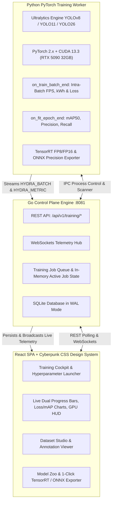

# HydraForge

> **High-Performance Cyberpunk-themed AI Training Studio for YOLOv8, YOLO11, and YOLO26. Built with Go Control Plane, PyTorch/CUDA 13.3 Worker, Real-Time Intra-Epoch Telemetry, and React SPA with 1-Click TensorRT Export.**

[**English**] | [**Português do Brasil**](README.pt-BR.md)

[](LICENSE)
[](https://go.dev/)
[](https://pytorch.org/)
[](https://developer.nvidia.com/cuda-toolkit)
[](https://github.com/ultralytics/ultralytics)
[](https://react.dev/)
[](https://developer.nvidia.com/tensorrt)

---

## The Problem

Training, fine-tuning, and optimizing state-of-the-art YOLO computer vision models for production edge deployments is typically hindered by fragmented tooling:

1. **Scattered CLI Scripts & Fragile Workflows:** Manual orchestration of dataset formatting (`data.yaml`), batch sizing, and learning rate scheduling across CLI flags.
2. **Disconnected Monitoring & Delayed Telemetry:** Most platforms only report metrics at epoch boundaries, leaving operators blind during long 70+ second epochs on large datasets.
3. **Complex Model Compilation & Export:** Converting raw PyTorch `.pt` checkpoints into optimized **TensorRT (`.engine`)** with mixed precision (FP16/FP8/INT8) requires error-prone C++ toolchains and manual TensorRT engine building.

---

## The Solution

**HydraForge** provides an all-in-one, high-performance **AI Model Training Cockpit & Compilation Studio**:

- **Native YOLOv8, YOLO11 & YOLO26 Support:** Full architecture matrix covering **Nano (n)**, **Small (s)**, **Medium (m)**, **Large (l)**, and **XLarge (x)** models across **Detection**, **Segmentation**, **Pose**, **Classification**, and **OBB (Oriented Bounding Box)** tasks.
- **Go Control Plane + Python CUDA Worker:** High-concurrency Go server (`:8081`) managing the training queue and broadcasting live WebSockets/REST telemetry, backed by an isolated Python PyTorch/CUDA 13.3 worker executing directly on the **NVIDIA GeForce RTX 5090 (32GB VRAM)**.
- **Intra-Epoch Batch Streaming:** Live telemetry emitted every 2–5 batches (~150ms) tracking fractional progress, real-time milliwatt energy integration ($kWh$), and train throughput ($FPS$).
- **Dual Progress & Lifecycle Controls:** Independent bars for **Current Epoch Progress (0–100%)** and **Total Session Progress**, with instant **ABORT**, **RESTART**, and **RESUME** actions.
- **Multi-GPU Telemetry Cycler:** Aggregates total cluster VRAM while automatically cycling between individual device sensors (Temp, Watts, SM load) every 3 seconds.
- **1-Click TensorRT & ONNX Exporter:** Compiles completed training runs directly into high-throughput **TensorRT `.engine`** files optimized for sub-millisecond edge inference in [HydraStream](https://github.com/eduardomdalmaso/HydraStream).

---

## Architecture Overview



---

## Key Studio Views

```text
┌───────────────────────────────────────────────────────────────────────────────────────────────────┐
│                                     HYDRAFORGE - STUDIO VIEWS                                     │
├───────────────┬─────────────────┬──────────────────┬──────────────────┬─────────────────┬─────────┤
│  1. COCKPIT   │  2. LIVE HUD    │  3. BENCHMARKS   │  4. DATASETS     │  5. MODEL ZOO   │ 6. TEST │
│   (LAUNCHER)  │  (MONITORING)   │   (SPEED & MAP)  │   (DATA & YAML)  │   (EXPORTER)    │ (PLAYG) │
└───────────────┴─────────────────┴──────────────────┴──────────────────┴─────────────────┴─────────┘
```

1. **Training Cockpit (`#cockpit`):** Model architecture selector, task variant picker, optimizer selection (`AdamW`, `SGD`), AMP FP16/BF16 toggles, two-stage fine-tuning switches, and dynamic VRAM estimation.
2. **Live Training HUD (`#live-hud`):** Dual progress bars (Epoch & Session), real-time energy budget ($kWh$), train throughput ($FPS$), vector loss/mAP charts, live PyTorch terminal logs, and multi-GPU sensor cycling.
3. **Benchmark Studio (`#benchmarks`):** Ultralytics multi-format benchmark launcher with live throughput comparison charts and speedup multipliers.
4. **Dataset Studio (`#datasets`):** `data.yaml` validation, train/val/test split sliders, class distribution frequency bar chart, and integrated bounding-box visualizer.
5. **Model Zoo & Exporter (`#model-zoo`):** Checkpoint comparison (`best.pt` vs `last.pt`), size vs mAP trade-off matrix, official & custom model repository, and 1-click **TensorRT (`.engine`)** compilation.
6. **Inference Playground (`#playground`):** Drag-and-drop image/video testing with real-time confidence and IoU threshold sliders.

---

## Engineering Guidelines & Strict Modularity

- **Hexagonal Architecture (DDD):** Pure domain logic in `internal/domain/` with zero HTTP/network dependencies.
- **Modular Frontend:** Strict `<100 lines per file` rule across all CSS, JS, and JSX files in `web/`.
- **Hardware Acceleration:** Native PyTorch with CUDA 13.3 (`sm_120` Blackwell support on RTX 5090).

---

## Quick Start & Development

### 1. Start HydraForge in Live Dev Mode
```bash
make dev
```
> Starts the Go Control Plane & React Training Studio on **`http://localhost:8081`**.

### 2. Run Test Suite
```bash
make test
```

### 3. Build Production Binaries
```bash
make build
```

---

## Roadmap

- [ ] **Fix Current Epoch Progress Bar Stream:** Correct intra-epoch batch callback telemetry payload synchronization so the Current Epoch progress bar animates live during intra-epoch batches.
- [ ] **Quantization-Aware Training (QAT) Engine:** Fine-tuning loop emulating INT8/FP8 quantization noise during training for zero-accuracy-loss edge deployment on NVIDIA TensorRT and edge NPUs.
- [ ] **Interactive Confusion Matrix & Class Diagnostics:** In-HUD drawer for granular per-class precision, recall, and F1-confidence curve optimization.
- [ ] **Overfitting Early-Warning Sentinel:** Real-time heuristic anomaly detection alerting on validation loss divergence.
- [ ] **HydraVault Active Learning Pipeline:** 1-click dataset synchronization with [HydraVault](https://github.com/eduardomdalmaso/HydraVault) for automated hard-negative retraining.

---

## License

This project is licensed under the [MIT License](LICENSE).
