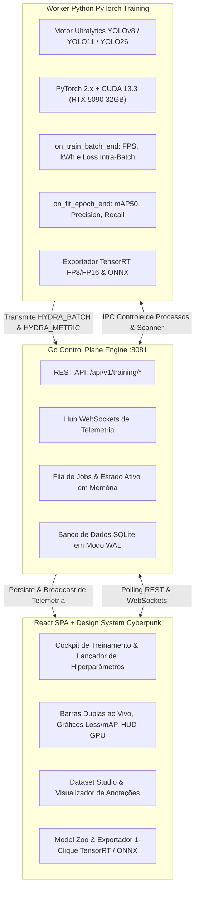

# HydraForge

> **Estúdio de Alta Performance com Interface Cyberpunk para Treinamento de Modelos YOLOv8, YOLO11 e YOLO26 com Go, PyTorch/CUDA 13.3, Telemetria Intra-Época em Tempo Real e Exportação 1-Clique para TensorRT.**

[**English**](README.md) | [**Português do Brasil**]

[](LICENSE)
[](https://go.dev/)
[](https://pytorch.org/)
[](https://developer.nvidia.com/cuda-toolkit)
[](https://github.com/ultralytics/ultralytics)
[](https://react.dev/)
[](https://developer.nvidia.com/tensorrt)

---

## O Problema

Treinar, ajustar e otimizar modelos YOLO de visão computacional para produção em edge geralmente envolve ferramentas fragmentadas:

1. **Scripts CLI Desconectados:** Orquestração manual de arquivos `data.yaml`, cálculo de batch size e curvas de learning rate via flags de terminal sujeitas a erros.
2. **Monitoramento com Atraso:** Plataformas tradicionais só reportam métricas ao final de cada época, deixando o operador no escuro durante longos períodos (70+ segundos) em datasets volumosos.
3. **Compilação e Exportação Complexa:** Converter checkpoints PyTorch `.pt` em motores **TensorRT (`.engine`)** otimizados em FP16/INT8 exige toolchains complexas em C++.

---

## A Solução

O **HydraForge** fornece um **Cockpit de Treinamento e Estúdio de Compilação de Modelos de IA** completo e integrado:

- **Suporte Nativo a YOLOv8, YOLO11 e YOLO26:** Matriz completa de arquiteturas cobrindo **Nano (n)**, **Small (s)**, **Medium (m)**, **Large (l)** e **XLarge (x)** em tarefas de **Detecção**, **Segmentação**, **Pose**, **Classificação** e **OBB (Caixas Orientadas)**.
- **Go Control Plane + Worker Python CUDA:** Servidor em Go de alta concorrência (`:8081`) gerenciando filas de jobs e WebSockets, integrado ao Worker Python PyTorch/CUDA 13.3 acelerado na **NVIDIA GeForce RTX 5090 (32GB VRAM)**.
- **Streaming Contínuo Intra-Época:** Emissão de telemetria a cada 2–5 batches (~150ms) rastreando progresso de lotes, orçamento de energia integrado ($kWh$) e throughput de treino ($FPS$).
- **Barras Duplas de Progresso & Controles de Ciclo de Vida:** Barra da **Época Atual (0–100%)** e Barra da **Sessão Total**, com ações imediatas de **ABORT**, **RESTART** e **RESUME**.
- **Ciclo Automático Multi-GPU:** Soma a VRAM total do cluster e alterna a cada 3 segundos a leitura individual dos sensores de temperatura, watts e carga de cada GPU.
- **Exportação 1-Clique para TensorRT e ONNX:** Converte modelos treinados diretamente em arquivos **TensorRT `.engine`** de altíssimo throughput para inferência no [HydraStream](https://github.com/eduardomdalmaso/HydraStream).

---

## Arquitetura Geral



---

## Páginas Principais

```text
┌───────────────────────────────────────────────────────────────────────────────────────────────────┐
│                                  HYDRAFORGE - PÁGINAS DO PROJETO                                  │
├───────────────┬─────────────────┬──────────────────┬──────────────────┬─────────────────┬─────────┤
│  1. COCKPIT   │  2. LIVE HUD    │  3. BENCHMARKS   │  4. DATASETS     │  5. MODEL ZOO   │ 6. TEST │
│   (LAUNCHER)  │  (MONITORAMENTO)│   (SPEED & MAP)  │   (DADOS & YAML) │   (EXPORTAÇÃO)  │ (PLAYG) │
└───────────────┴─────────────────┴──────────────────┴──────────────────┴─────────────────┴─────────┘
```

1. **Cockpit de Treinamento (`#cockpit`):** Seletor de modelo, tarefa, optimizer (`AdamW`, `SGD`), switches AMP FP16/BF16, ajuste two-stage fine-tuning e estimativa dinâmica de VRAM.
2. **Live Training HUD (`#live-hud`):** Barras duplas de progresso (Época e Sessão), cálculo em tempo real de energia ($kWh$) e velocidade ($FPS$), gráficos vetoriais de loss/mAP, logs do terminal e monitor de hardware GPU.
3. **Benchmark Studio (`#benchmarks`):** Suite de testes de benchmark Ultralytics multi-formato (TensorRT vs ONNX vs PyTorch) com gráfico de throughput e matriz de speedup.
4. **Dataset Studio (`#datasets`):** Validação de `data.yaml`, sliders de split treino/val/teste, gráfico de distribuição de classes e visualizador de caixas delimitadoras.
5. **Model Zoo & Exportador (`#model-zoo`):** Repositório de modelos oficiais e customizados, comparação de checkpoints (`best.pt` vs `last.pt`) e compilação em 1 clique para **TensorRT (`.engine`)**.
6. **Playground de Inferência (`#playground`):** Teste de imagens e vídeos com sliders de confiança e IoU em tempo real.

---

## Diretrizes de Engenharia e Modularidade Estrita

- **Arquitetura Hexagonal (DDD):** Lógica de negócio pura em `internal/domain/` sem dependências de rede/HTTP.
- **Frontend Modular:** Limite estrito de **`< 100 linhas por arquivo`** em todos os arquivos CSS, JS e JSX de `web/`.
- **Aceleração de Hardware:** PyTorch nativo com CUDA 13.3 (suporte à arquitetura Blackwell `sm_120` na RTX 5090).

---

## Início Rápido

### 1. Iniciar o HydraForge em Modo Dev
```bash
make dev
```
> Inicia o Control Plane em Go e a interface de treinamento em **`http://localhost:8081`**.

### 2. Executar os Testes
```bash
make test
```

### 3. Compilar os Binários de Produção
```bash
make build
```

---

## Roadmap

- [ ] **Correção da Barra de Progresso da Época Atual (Current Epoch Progress):** Corrigir a sincronização do payload de telemetria intra-batch para que a barra de progresso da época atual anime em tempo real durante os lotes.
- [ ] **Motor de Quantization-Aware Training (QAT):** Loop de fine-tuning simulando ruído de quantização INT8/FP8 durante o treino para deploy com 0% de perda de precisão no TensorRT e NPUs de borda.
- [ ] **Matriz de Confusão Interativa & Diagnóstico por Classe:** Visualizador integrado no HUD para inspeção granular de precisão, recall e curva ótima de F1-Score.
- [ ] **Sentinela de Alerta Precoce de Overfitting:** Detecção heurística em tempo real de divergência na perda de validação.
- [ ] **Pipeline de Active Learning com HydraVault:** Sincronização em 1 clique com o [HydraVault](https://github.com/eduardomdalmaso/HydraVault) para retreino automático com hard-negatives.

---

## Licença

Este projeto está licenciado sob a [Licença MIT](LICENSE).
