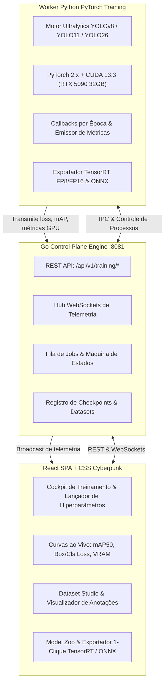

# HydraForge

> **Estúdio de Alta Performance com Interface Cyberpunk para Treinamento de Modelos YOLOv8, YOLO11 e YOLO26 com Go, PyTorch/CUDA 13.3 e React com Exportação 1-Clique para TensorRT.**

[**English**](README.md) | [**Português do Brasil**]

[](LICENSE)
[](https://go.dev/)
[](https://pytorch.org/)
[](https://developer.nvidia.com/cuda-toolkit)
[](https://github.com/ultralytics/ultralytics)
[](https://react.dev/)
[](https://developer.nvidia.com/tensorrt)

---

## O Problema

Treinar, ajustar e otimizar modelos YOLO de visão computacional para produção em edge geralmente envolve ferramentas fragmentadas:

1. **Scripts CLI Desconectados:** Orquestração manual de arquivos `data.yaml`, cálculo de batch size e curvas de learning rate via flags de terminal sujeitas a erros.
2. **Monitoramento Isolado:** Dependência de plataformas SaaS pesadas que adicionam latência e não possuem telemetria direta do hardware GPU (VRAM, carga dos Tensor Cores, temperatura).
3. **Compilação e Exportação Complexa:** Converter checkpoints PyTorch `.pt` em motores **TensorRT (`.engine`)** otimizados em FP16/INT8 exige toolchains complexas em C++.

---

## A Solução

O **HydraForge** fornece um **Cockpit de Treinamento e Estúdio de Compilação de Modelos de IA** completo e integrado:

- **Suporte Nativo a YOLOv8, YOLO11 e YOLO26:** Matriz completa de arquiteturas cobrindo **Nano (n)**, **Small (s)**, **Medium (m)**, **Large (l)** e **XLarge (x)** em tarefas de **Detecção**, **Segmentação**, **Pose**, **Classificação** e **OBB (Caixas Orientadas)**.
- **Go Control Plane + Worker Python CUDA:** Servidor em Go de alta concorrência (:8081) gerenciando filas de jobs e WebSockets, integrado ao Worker Python PyTorch/CUDA 13.3 acelerado na **NVIDIA GeForce RTX 5090 (32GB VRAM)**.
- **HUD Cyberpunk em Tempo Real:** Curvas SVG Bézier ao vivo para funções de loss (`box_loss`, `cls_loss`, `dfl_loss`), métricas de precisão (`mAP@50`, `mAP@50-95`) e sensores de hardware (VRAM, Tensor Cores, Watts).
- **Dataset Studio & Matriz de Classes:** Validação de `data.yaml`, galeria de visualização de anotações e gráfico de barras para detecção prévia de classes desbalanceadas.
- **Exportação 1-Clique para TensorRT e ONNX:** Converte modelos treinados diretamente em arquivos **TensorRT `.engine`** de altíssimo throughput para inferência no [HydraStream](https://github.com/eduardomdalmaso/HydraStream).

---

## Arquitetura Geral



---

## Páginas Principais

```
┌───────────────────────────────────────────────────────────────────────────────────────────────────┐
│                                  HYDRAFORGE - PÁGINAS DO PROJETO                                  │
├───────────────┬─────────────────┬──────────────────┬──────────────────┬─────────────────┬─────────┤
│  1. COCKPIT   │  2. LIVE HUD    │  3. BENCHMARKS   │  4. DATASETS     │  5. MODEL ZOO   │ 6. TEST │
│   (LAUNCHER)  │  (MONITORAMENTO)│   (SPEED & MAP)  │   (DADOS & YAML) │   (EXPORTAÇÃO)  │ (PLAYG) │
└───────────────┴─────────────────┴──────────────────┴──────────────────┴─────────────────┴─────────┘
```

1. **Cockpit de Treinamento (`#cockpit`):** Seletor de modelo, tarefa, optimizer (`AdamW`, `SGD`, `RMSprop`), Cosine LR, switches AMP FP16/BF16 e estimativa de VRAM.
2. **Live Training HUD (`#live-hud`):** Curvas de loss e mAP em tempo real, galeria visual de predições por época e monitor de hardware da RTX 5090.
3. **Benchmark Studio (`#benchmarks`):** Suite de testes de benchmark Ultralytics multi-formato (TensorRT vs ONNX vs PyTorch) com gráfico de throughput e matriz de speedup.
4. **Dataset Studio (`#datasets`):** Validação de `data.yaml`, sliders de split treino/val/teste e gráfico de barras de frequência de classes.
5. **Model Zoo & Exportador (`#model-zoo`):** Comparação de checkpoints (`best.pt` vs `last.pt`) e compilação em 1 clique para **TensorRT (`.engine`)**.
6. **Playground de Inferência (`#playground`):** Teste de imagens e vídeos com sliders de confiança e IoU em tempo real.

---

## Início Rápido

### 1. Iniciar o HydraForge em Modo Dev
```bash
make dev
```
> Inicia o Control Plane em Go e a interface de treinamento em **`http://localhost:8081`**.

### 2. Executar os Testes
```bash
make test
```

### 3. Compilar os Binários de Produção
```bash
make build
```

---

## Licença

Este projeto está licenciado sob a [Licença MIT](LICENSE).
